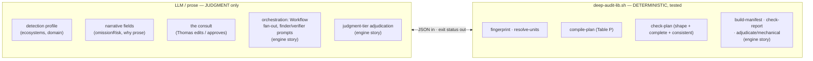
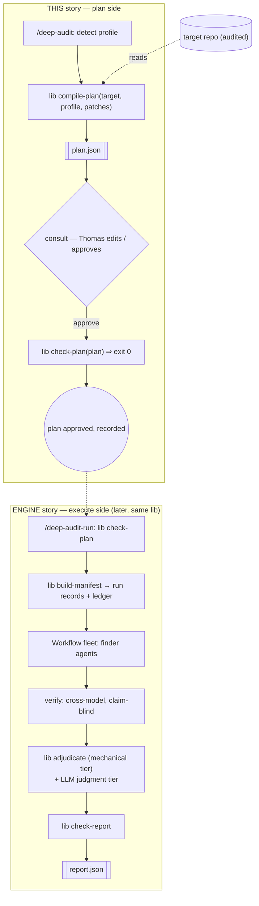
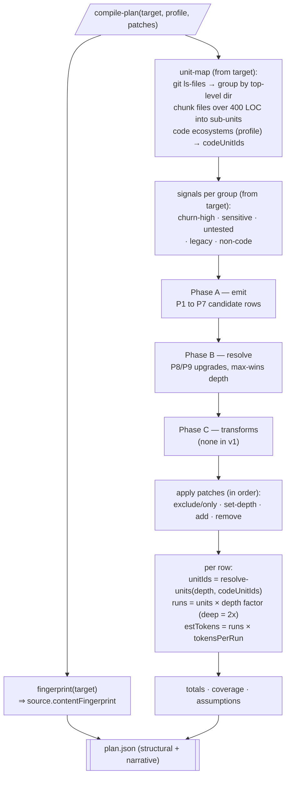
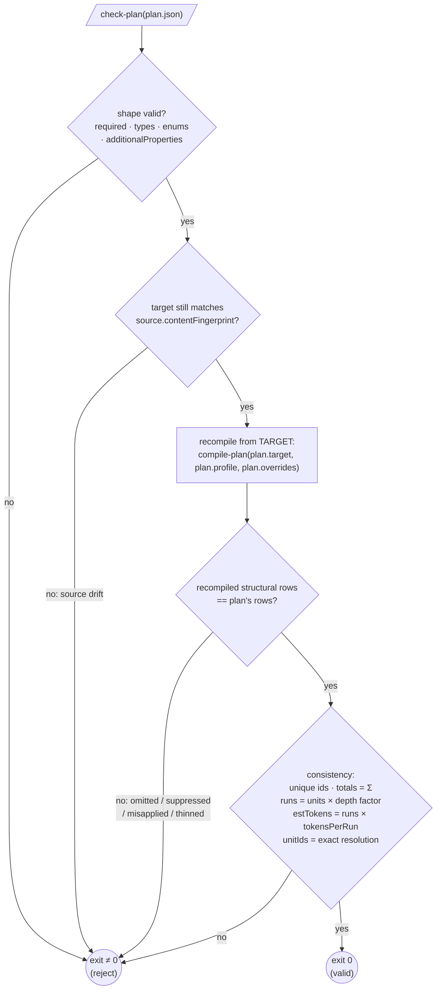

# deep-audit subsystem — architecture (design, pre-build)

Written before building `compile-plan` / `check-plan`. Captures the shape decided across the
`deep-audit-engine` review journey (the pivot: extract the deterministic core to a tested shell
library) and the two subcommands about to be built. Diagrams are Mermaid (text, version-controlled).

**One idea:** every *deterministic* rule lives once, in `deep-audit-lib.sh`, enforced by a behavioral
test. The LLM keeps only *judgment* — detection, narrative, orchestration, the consult, and the
judgment-tier adjudication. `plan.json` / `report.json` are the contracts between them; the lib is the
single validator (no separate `plan-schema.json`).

---

## A. The deterministic / LLM boundary — who owns what

---

## B. Data flow — this story (plan side) and the engine story (execute side, dashed)

---

## C. `compile-plan` — the Table-P compiler (the piece being built next)

Inputs: `target root` · `profile.json` (the LLM detection) · optional `patches`. Everything else is
**derived from the target itself** (LV-1) so a plan can never be validated against its own echoed
inputs.

---

## D. `check-plan` — the canonical validator (shape + completeness + consistency)

The crux of the whole pivot: completeness is proven by **recompiling from the target**, not by
trusting the plan's own numbers.

---

## Scope legend

| Built in **THIS** story (`deep-audit-lib`) | Deferred to the **engine** story |
|---|---|
| `fingerprint` ✓ · `resolve-units` ✓ (done, tested) | `build-manifest` · `check-report` · `adjudicate` (mechanical tier) |
| `compile-plan` · `check-plan` (next) | the lens×altitude capability table |
| `/deep-audit` refactored to call the lib; `plan-schema.json` removed | `/deep-audit-run` orchestration (Workflow, prompts, verify, synthesis) |
| behavioral test suite (`tests/deep_audit_lib_test.sh`) | judgment-tier adjudication (prose) |

**Contract invariants (enforced by the lib, tested):** JSON in / exit-status out; deterministic
derivation from the target only; one canonical validator (no second schema copy); every tampered
input is rejected by a test.
